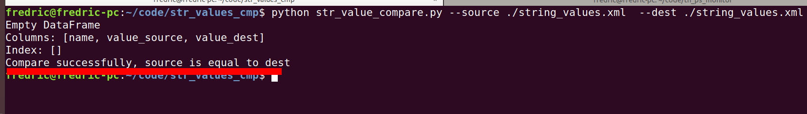
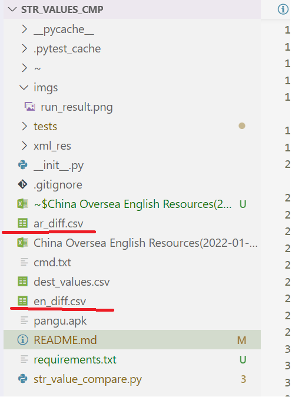

# 资源文件比较工程

## 背景

该工程用于比较原始的apk和翻译的xlsx文件中的内容。
输入的数据为原始的apk文件和翻译公司生成的xlsx文件。
先从jenkins下载相关的apk，再找开发要相应的翻译文件xlsx。作为输入即可。


## 前提

运行之前请先在电脑上安装相关python依赖。
```shell
    pip install -r requirements.txt
```


## 使用方法

典型的使用方法如下，

```shell
    # 英语
    python str_value_compare.py --source ./pangu.apk --source_col "en" --dest "China Oversea English Resources(2022-01-20).xlsx" --dest_col "English text" --dest_sheet "wukong"

    # 阿拉伯语
    python str_value_compare.py --source ./pangu.apk --source_col "ar" --dest "China Oversea English Resources(2022-01-20).xlsx" --dest_col "ar(Arabic)" --dest_sheet "wukong"

```

```shell
    参数说明:
     source: APK 文件名字，一般放在当前工程目录下，用相对路径即可
     source_col: 相应的语言在apk文件中的代码，
      包含如下代码
      ['\x00\x00', 'th', 'ca', 'da', 'fa', 'ja', 'ka', 'pa', 'ta', 'nb', 'be', 'de', 'ne', 'te', 'af', 'bg', 'fi', 'hi', 'si', 'vi', 'kk', 'mk', 'sk', 'uk', 'el', 'gl', 'ml', 'nl', 'pl', 'sl', 'tl', 'am', 'km', 'bn', 'en', 'in', 'kn', 'mn', 'ko', 'lo', 'ro', 'sq', 'ar', 'fr', 'hr', 'mr', 'or', 'sr', 'tr', 'ur', 'as', 'bs', 'cs', 'es', 'is', 'ms', 'et', 'it', 'lt', 'pt', 'eu', 'gu', 'hu', 'ru', 'zu', 'lv', 'sv', 'iw', 'sw', 'hy', 'ky', 'my', 'az', 'uz', 'en-rCA', 'fr-rCA', 'uk-rUA', 'en-rGB', 'en-rXC', 'de-rDE', 'sv-rSE', 'bg-rBG', 'th-rTH', 'fi-rFI', 'sl-rSI', 'da-rDK', 'zh-rHK', 'sk-rSK', 'nl-rNL', 'pl-rPL', 'zh-rCN', 'en-rIN', 'no-rNO', 'ro-rRO', 'pt-rBR', 'el-rGR', 'hr-rHR', 'tr-rTR', 'sr-rCS', 'es-rUS', 'it-rIT', 'pt-rPT', 'en-rAU', 'hu-rHU', 'ru-rRU', 'zh-rTW', 'es-rMX', 'cs-rCZ']

      其中，'\x00\x00'表示主语言， 其实就是en。
      ja, 表示日语。
      ar, 表示阿拉伯语。
      其他的我也不是测这个的，或者开发这个的，请找开发去问。联系人Wang AnZhou。
     dest: 开发提供的xlsx语言文件，找开发要
     dest_col: 语言文件中对应的列，不清楚的去问开发吧。
     dest_sheet: 这个是说特定项目对应的sheet。 查看那个xlsx文件，可取值包括"wukong", "nezha"和"mulan"。
```


输出结果再当前目前下，

如果是阿拉伯语，就是ar_diff.csv。

如果是英语，就是en_diff.csv。

整体效果如图所示。




